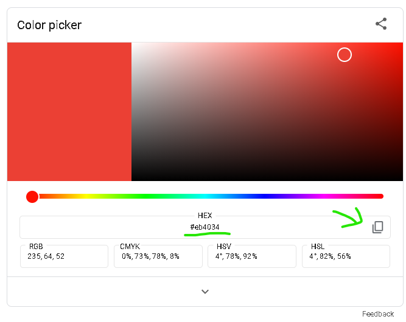

# Background Color Change

## Introduction

This project will continue off the last project, the About Me page. In this project, you will change the color of your website's background, and get a sneak peak at some JavaScript code at work!

## Table of Contents

- [Step-by-Step Guide](#step-by-step-guide)
  - [1. CSS](#1-css)
  - [2. Add a button](#2-add-a-button)
- [Stretch Goals](#stretch-goals)
- [Conclusion](#conclusion)


## Step-by-Step Guide

### 1. CSS

Go to [codepen.io](codepen.io) and look at the CSS section in the middle. If you already have some code there from the last project, keep it there! We'll add on to the last project.

We're going to change the background color of our website. In order to do this, we'll need to target the ```body``` element and change the ```background-color``` property. Go to an empty space in your CSS, outside of any existing ```}``` braces, and type:

```
body {
  background-color: blue;
}
```

**_NOTE:_** Don't forget the semicolon ```;``` at the end! If you forget it might cause problems later!

If everything is correct, your website's background should now be blue! Changing what you put at ```background-color:``` will change what the color is. CSS only knows a couple specific colors such as:

- black
- silver
- red
- purple
- navy
- darkgreen
- fuchsia
- and a lot more found at [this website here](https://www.w3.org/wiki/CSS/Properties/color/keywords)

but sometimes you want a color that's more specific than the ones on the list. To choose a more specific color, search up __color picker__ on Google, which should bring up something like this:



This lets you choose a specific color. When you have the one you want, add the HEX color code into your CSS. Pressing the box icon on the right will copy it, which lets you paste it into your CSS.

```
body {
  background-color: #a1f1ff;
}
```

**_NOTE:_** These colors can also be used to change your text's color. Change the ```color``` property to do this. 

### 2. Add a button

Let's add a button to your website, and when you press the button, it'll run code to cycle through different colors. First, add a ```button``` element by typing "button" and pressing tab:

```
<button></button>
```

In the middle of the two carrots (```><```) write something like "Change color!". This will be what your button says on it.

Next, we'll add the JavaScript code that'll change the background color. On the right of your Codepen is the JS box. Copy and paste this code into there:

```
const colors = ["red", "blue", "green", "yellow", "purple", "orange"];
let currentIndex = 0;

function changeColor() {
  // Set the background to the next color in the array
  document.body.style.backgroundColor = colors[currentIndex];
  currentIndex = (currentIndex + 1) % colors.length;
}
```

Now, let's attach the button to the ```changeColor()``` function, using the onclick property. We could use CSS for this, but let's practice adding properties directly to HTML elements. add ```onclick="changeColor()"``` in between ```<button``` and ```>```.

```
<button onclick="changeColor()">Change Color!</button>
```

Test out your button!

## Stretch Goals
Go to the JavaScript code at take a look at the first line. 

```
const colors = ["red", "blue", "green", "yellow", "purple", "orange"];
```

Try replacing these colors with different colors you like better. Make sure to put them between quotations ```""```! Hex codes work as well (for example ```"#a1f1ff"```)

Use the ```color``` property in the ```body``` tag to change the color of your text!
```
body {
  background-color: white;
  color: purple;
}
```

## Conclusion

Congratulations! You've created a simple website that changes the background color using HTML, CSS, and JavaScript. This is just the beginning – there are many more features and technologies to explore. 
